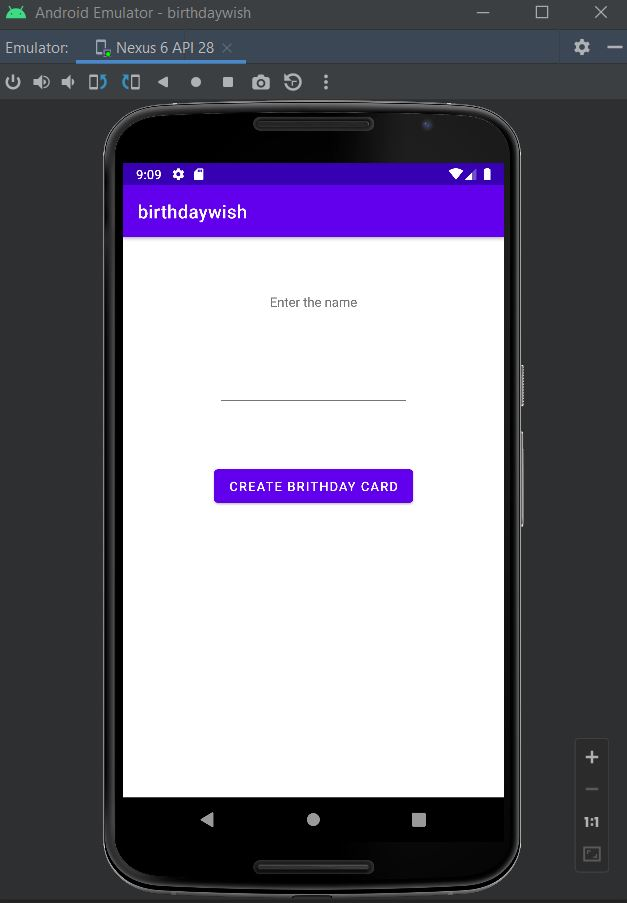
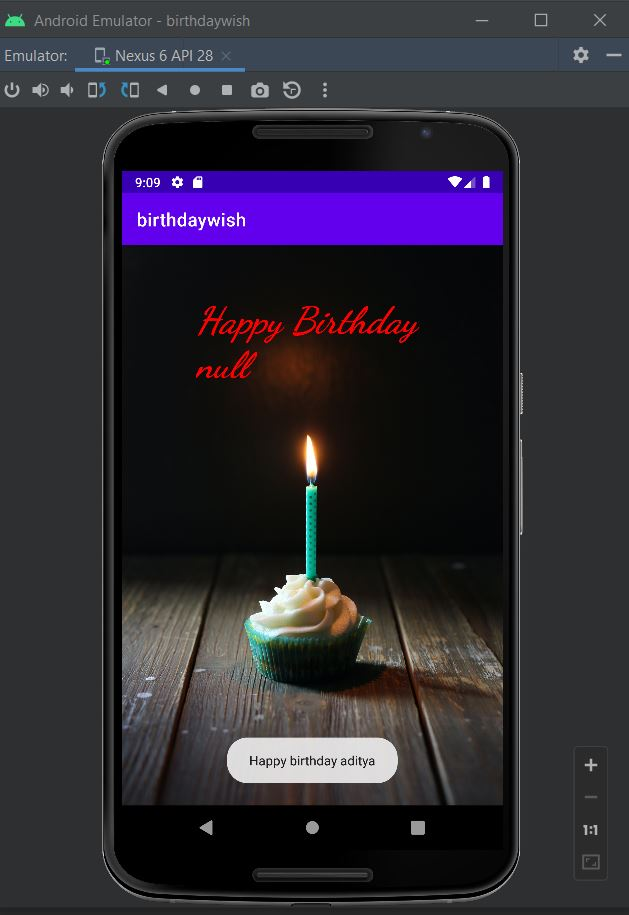

# Birthday-Wishing-Android-app
<h3 align="center">This app contains 2 layouts ; first one for home section , which will have button and text input as a name ; Second one will show greeting message and photo to the user.<h3>
 
 

 
 

 
 
<h3 align="center"> To use this project download the .zip file , then navigate your self to this path "birthdaywish\app\src\main\java\com\example\birthdaywish" for Kotlin files and for layout xml files this path "birthdaywish\app\src\main\res\layout"</h3>
 
 
<h1 align="center">The End</h1>
